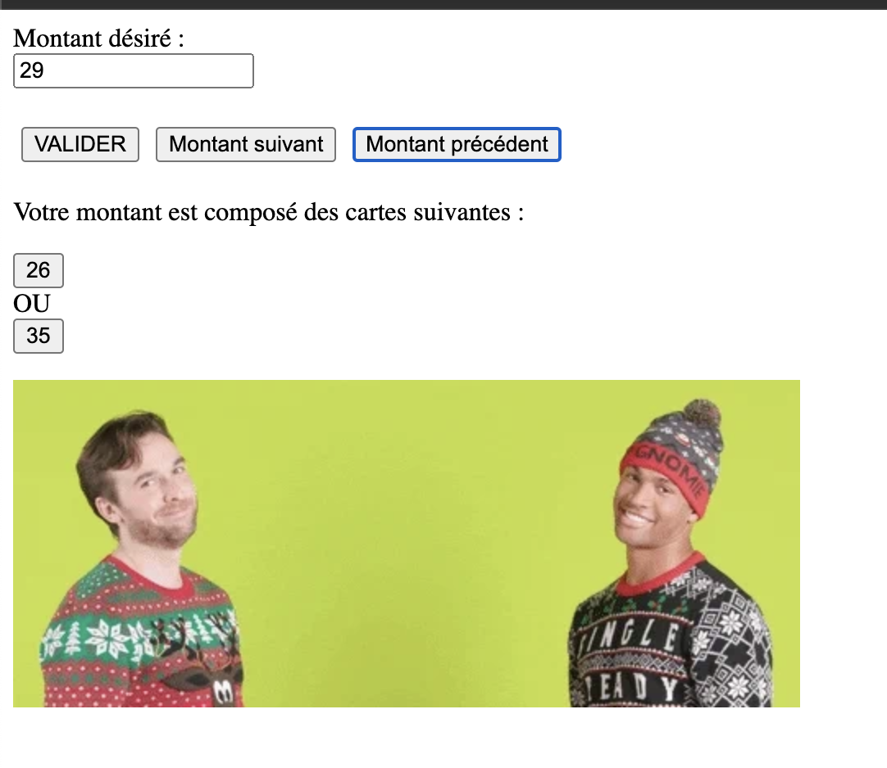

# Wedoogift

This project was generated with [Angular CLI](https://github.com/angular/angular-cli) version 13.3.3.

## Goal

The purpose of this project is to show a list of gift cards available depending on the amount wanted by the user
## Preview

## Installation
Tip : use two differents terminals
1. `cd calculator-server && npm install`
2. `npm start`

3. `cd wedoogift && npm i`
4. `npm start`

## Usage

Navigate to `http://localhost:4200/`. The application will automatically reload if you change any of the source files.
